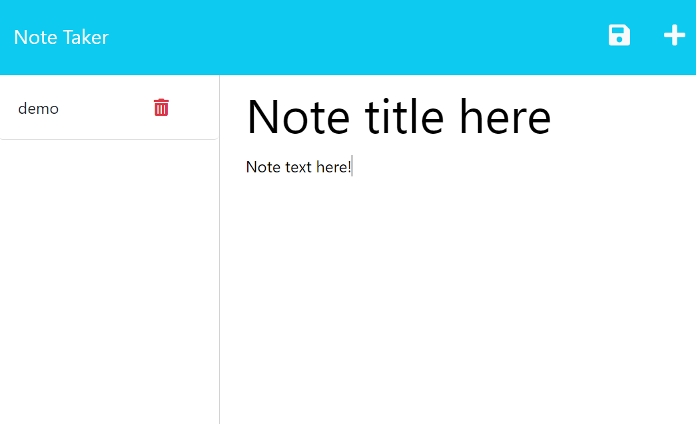

# Note Taker

## Overview
As the title suggests, this application is used for writing and saving notes in a single place. It was created in order to practice using our new coding knowledge of ExpressJS.  

## Usage
A user of this application can write a note in the provided text boxes and save them by clicking on the add/save icon in the top right. The saved notes will be visible and accessible to read in a column on the left. The notes can be deleted if needed.

## Technologies
This application utilizes HTML, CSS, Bootstrap styling, Javascript, NodeJS, as well as ExpressJS to build the back end of the application. 

## Credits
Starter code for this application was provided by Github user @Xandromus. 

## Heroku Deployment
Link to application on Heroku: https://notetaker666.herokuapp.com/
